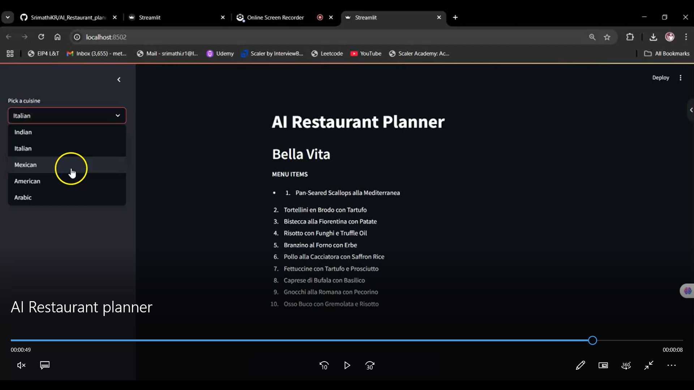
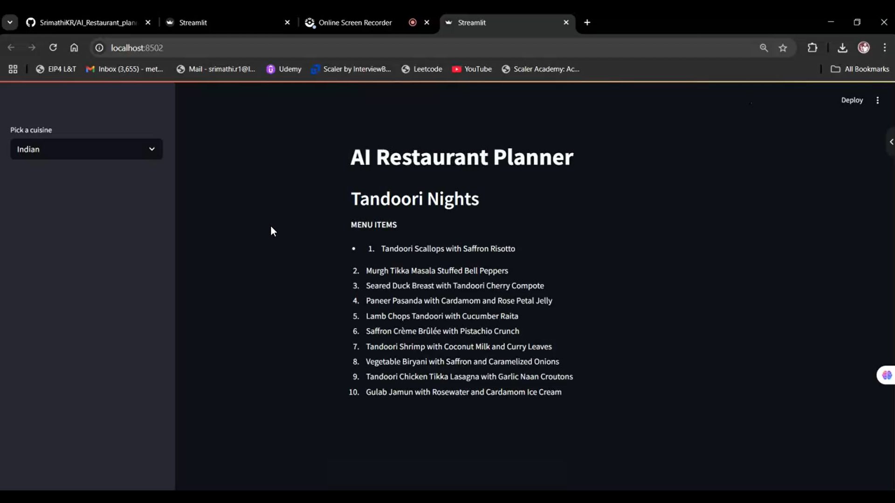

# 🍽️ AI Restaurant Planner

Welcome to the **AI Restaurant Planner** – a simple and interactive AI Streamlit app that generates a restaurant name and menu based on your chosen cuisine using AI!

## 🚀 Features

- Choose from multiple cuisines: **Indian**, **Italian**, **Mexican**, **American**, or **Arabic**
- Instantly generate a unique restaurant name
- Get a list of menu items curated by AI for the selected cuisine

## 🛠️ Installation & Setup

1. **Clone the repository**
git clone https://github.com/SrimathiKR/AI_Restaurant_planner.git
cd AI_Restaurant_planner
2. **Install required packages**
pip install streamlit
3. **Run the App**
streamlit run main.py
4. **Other requirements**
Have a API key and place it in the variable given
5. **License**
This project is licensed under the MIT License.
6. **Working Screenshots**

